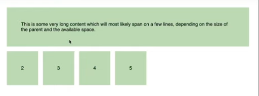
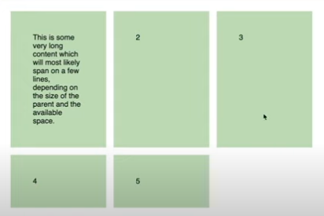

# Frontend Mentor - Single price grid component solution

This is a solution to the [Single price grid component challenge on Frontend Mentor](https://www.frontendmentor.io/challenges/single-price-grid-component-5ce41129d0ff452fec5abbbc). Frontend Mentor challenges help you improve your coding skills by building realistic projects.

## Table of contents

- [Overview](#overview)
  - [The challenge](#the-challenge)
  - [Screenshot](#screenshot)
  - [Links](#links)
- [My process](#my-process)
  - [Built with](#built-with)
  - [What I learned](#what-i-learned)
  - [Continued Development](#continued-development)
  - [Useful resources](#useful-resources)
- [Author](#author)

## Overview

### The challenge

Users should be able to:

- View the optimal layout for the component depending on their device's screen size
- See a hover state on desktop for the Sign Up call-to-action

### Screenshot

### Links

- Github Repo URL: [Single Price Grid Repo](https://github.com/amyspencerproject/single-price-grid)
- Live Site URL: [Single Price Grid Page](https://amyspencerproject.github.io/single-price-grid/)

## My process

### Built with

- Semantic HTML5 markup
- CSS Variables
- CSS Flex
- Mobile-first workflow

### What I learned

- Still unsure when to use CSS Grind and when to use Flex. I am have a few resouces bookmarked that come reccomended by other dev folks. I am just going to read or watch a video every time I have to decide and then just experiment. There is not one answer! The point is to just understand both and gain insight into when to use one over the other. Best way to get that insight is by trial and error 😅
- Quote from Adi Purdila Grid + Flex Tutorial "When deciding which tool to use you must decide on the desired behavior."

  "Do you want to let the content shape your layout? _Use Flex_."

  "Or do you want your layout to shape your content? _Use Grid_."

- The layout, the size/spacing of elements are defined by the content in Flex. The larger amount of text in a cell will result in a larger div for that element.
  

- With Grid the layout defines where the content is contained. This example is for a three column grid with 1fr each. The shape of the content is defined by the sizing of the grid layout. The content must adapt to the layout.
  

- Hayden Pickering responsive grid layout technique. Set `grid-template-columns: repeat(auto-fill, minmax(20rem, 1fr))`. This code says I want as many columns as possible with a minimum width of 20rems. Large viewports will have many columns and smaller viewports will only have one or two columns.

- Decided to go with Flex for this component 😃

- The Figma file for this challenge has drop shadow effects to set the color for the lighter cyan card. This is not cool for the developer who has to find a color to match whatever transparency was set by the designer. It took some reading but I did eventually figure out that an hsla value can be used to get the lighter cyan color.

  `cyan: hsl(179, 62%, 43%);`

  `light-cyan: hsla(179, 62%, 43%, 0.75);`

  Also had to do the same thing for the shadowing around the the button and the entire component. This shadowing was done with black as the base color with barely any opacity, `shadow: hsla(0, 0%, 0%, 0.1)`

### Continued development

### Useful resources

- [CSS Grid vs. Flexbox](https://webdesign.tutsplus.com/articles/flexbox-vs-css-grid-which-should-you-use--cms-30184) - This article was suggested to me by someone from FEM. It has other resources inside of it explaining even more aspects to consider.
- [Grid + Flex Tutorial with Adi Purdila](https://youtu.be/18VLSXfsj94) - This video was very clear and had great examples of using Grid and using Flex.
- [hsla color defined](https://www.w3schools.com/html/html_colors_hsl.asp#:~:text=HSLA%20color%20values%20are%20an%20extension%20of%20HSL%20color%20values,not%20transparent%20at%20all)%3A)
- [CSS Tricks with Color](https://css-tricks.com/hsl-hsla-is-great-for-programmatic-color-control/)

- [Quick guide to ul de-styling](https://www.w3schools.com/howto/howto_css_list_without_bullets.asp) - I can never remember that it is `list-style-type:none`

## Author

- Website - [Amy Spencer](https://spencerproject.com/)
- Frontend Mentor - [@amyspencerproject](https://www.frontendmentor.io/profile/amyspencerproject)
- Linkedin - [amyspencercodes](https://www.linkedin.com/in/amyspencercodes/)
